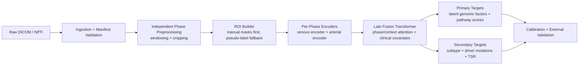

# RadiogenPDAC

Cluster-ready scaffold for PDAC radiogenomics based on the idea in Liao et al. (2024), but updated for a more robust goal: learn CT-derived feature embeddings that predict tumor genomic signatures rather than only a single histopathology surrogate.

## Why this framework looks different from the paper

The paper you shared used a CLIP-adapter with self-attention to predict tumor-stroma ratio from dual-phase CT and showed that multi-phase fusion beat single-phase inputs. That is the right design direction for your use case too, especially because you have venous and arterial phases for most patients and already have a strong venous-phase detector. I would keep the paper's central idea of:

1. multi-phase imaging,
2. feature fusion,
3. representation learning instead of hand-crafted features only,
4. biological endpoints rather than segmentation as the final goal.

I would not keep the task definition as-is. Your endpoint is richer and harder: a complete genomic signature. That changes the target design and the data engineering strategy.

## Recommendation on the genomic target

Do not start by clustering patients and using cluster IDs as the primary label.

That is useful as an exploratory analysis, but it is usually too unstable to be the main supervision target unless you already have a validated molecular subtype system and enough samples per subtype. If you force unsupervised clusters too early, the model may learn cluster artifacts instead of biologically meaningful imaging-genomics relationships.

The more robust approach is a hybrid target stack:

1. Primary targets: low-dimensional transcriptomic or genomic factors derived from the full signature.
2. Secondary targets: biologically meaningful pathway scores and known categorical labels such as basal-like/classical subtype, HRD-like state, stromal programs, immune programs, and major driver mutations.
3. Auxiliary targets: optional cluster labels derived from the latent genomic space, used only for interpretation or regularization.

In practice:

- If your cohort is modest, predicting the whole raw signature gene-by-gene is likely underpowered.
- If you truly have a very large cohort, you can add gene-level heads later, but I would still train the first robust model on latent factors plus pathway programs.
- Fit the latent representation on the training folds only to avoid leakage.

Suggested target construction:

1. Start from the complete genetic signature.
2. Build a low-dimensional representation using NMF, sparse PCA, VAE, or MOFA-style factorization.
3. Add curated pathway scores such as stromal activation, hypoxia, EMT, immune infiltration, DNA repair, cell-cycle, and KRAS signaling.
4. Add a few explicit binary heads for major drivers if available.
5. Optionally derive patient clusters from the latent factors for visualization only.

Short answer:

- Use the whole signature as the information source.
- Do not use the whole raw signature as the first prediction target.
- Do not use patient clusters as the primary target.
- Use compressed latent factors plus pathway scores as the main targets.

## Imaging strategy

Because pancreas and PDAC deform non-rigidly between arterial and venous phase, I would not make accurate voxel-wise arterial-to-venous registration a dependency for the main model.

Recommended policy:

1. Run the venous-phase detector on every case.
2. Build phase-specific crops independently for venous and arterial data.
3. Use detector outputs plus any manual masks to generate ROI crops and context crops.
4. Encode each phase separately and fuse them with attention at the embedding level.
5. Treat segmentation as a utility for localization and attention, not as the final benchmark.

Your detector already identifies pancreas, PDAC, duct, CBD, arteries, and veins. That is valuable because genomic signal in PDAC is not only inside the tumor core. The surrounding pancreas, desmoplastic stroma, vascular involvement, and ductal anatomy may all carry signal.

So I would not train only on a tight tumor crop. I would train a multi-context encoder with:

- tumor-focused crop,
- pancreas-context crop,
- vascular-context crop,
- dual-phase fusion.

Manual masks should be used wherever they exist. For the rest, generate pseudo-labels from your detector and carry confidence scores through preprocessing and training. Low-confidence pseudo-labels should be excluded from strict ROI losses but can still be used for weak attention and crop generation.

## Framework overview



## Project structure

```text
RadiogenPDAC/
├── configs/
│   ├── data/default.yaml
│   ├── model/multiphase_encoder.yaml
│   ├── target/hybrid_signature.yaml
│   └── train/default.yaml
├── scripts/slurm/
│   ├── preprocess_array.sh
│   └── train_ddp.sh
├── src/radiogenpdac/
│   ├── __init__.py
│   ├── cli.py
│   ├── config.py
│   ├── datamodule.py
│   ├── dataset.py
│   ├── framework.py
│   ├── lightning_module.py
│   ├── losses.py
│   ├── manifests.py
│   ├── model.py
│   ├── preprocessing.py
│   └── splits.py
│   ├── targets.py
│   └── train.py
├── templates/
│   ├── cohort_manifest.example.csv
│   └── genomics_manifest.example.csv
├── pyproject.toml
└── README.md
```

## Framework choices

These are the frameworks I would use for a production-grade research setup:

- [MONAI](https://docs.monai.io/en/latest/) for medical image IO, transforms, medical-model building blocks, and multi-GPU support.
- [PyTorch Lightning](https://lightning.ai/docs/pytorch/stable/) for distributed training, checkpointing, logging hooks, and cleaner cluster execution.
- [Hydra](https://hydra.cc/docs/intro/) style config composition for reproducible experiments and sweeps.
- [MLflow](https://mlflow.org/docs/latest/ml/tracking/) for experiment tracking and artifact lineage.

Why these:

- MONAI is purpose-built for healthcare imaging and documents flexible preprocessing, domain-specific components, and multi-GPU or multi-node support.
- Lightning is a stable way to keep distributed training readable and reproducible.
- Hydra makes it much easier to sweep over target definitions, crop policies, and backbone variants without turning the codebase into script sprawl.
- MLflow gives you a durable experiment registry for internal and external validation runs.

## Data ingestion

Create two manifests:

1. Cohort manifest with imaging and metadata.
2. Genomics manifest with patient-level genomic targets.

Minimum cohort manifest columns:

- `patient_id`
- `study_id`
- `site`
- `venous_image`

Recommended additional cohort columns:

- `arterial_image`
- `venous_tumor_mask`
- `arterial_tumor_mask`
- `tumor_mask`
- `venous_pancreas_mask`
- `arterial_pancreas_mask`
- `pancreas_mask`
- `detector_json`
- `venous_encoder_features`
- `arterial_encoder_features`
- `split_group`
- `age`
- `sex`
- `ca19_9`
- `stage`

Minimum genomics manifest columns:

- `patient_id`
- `signature_vector_path`

Recommended additional genomics columns:

- `pathway_scores_json`
- `subtype_label`
- `driver_mutations_json`
- `tsr_label`

Templates are included in:

- [templates/cohort_manifest.example.csv](/Users/felipe/Documents/Playground/RadiogenPDAC/templates/cohort_manifest.example.csv)
- [templates/genomics_manifest.example.csv](/Users/felipe/Documents/Playground/RadiogenPDAC/templates/genomics_manifest.example.csv)
- [templates/phase_ingestion_manifest.example.csv](/Users/felipe/Documents/Playground/RadiogenPDAC/templates/phase_ingestion_manifest.example.csv)

## Environment setup

For the cluster workflow, start with a dedicated fine-tuning environment built from the new top-level [requirements.txt](/Users/felipe/Documents/Playground/RadiogenPDAC/requirements.txt). That file is intended for the `PDAC_Detection` fine-tuning, validation, and encoder-extraction pipeline.

Example on a cluster that uses modules plus Conda:

```bash
module load miniconda
conda create -y -n pdac-ft python=3.10
conda activate pdac-ft
python -m pip install --upgrade pip setuptools wheel
python -m pip install -r requirements.txt
python -m pip install --no-build-isolation -e .
```

If you previously installed an older environment before this fix, repair it with:

```bash
python -m pip install --upgrade "setuptools>=68" "typing-extensions>=4.14.1"
python -m pip install --no-build-isolation -e .
```

Quick sanity check:

```bash
radiogenpdac --help
python -c "import torch, SimpleITK, typer, rich; print('env ok')"
```

Why I recommend this split:

- the detector stack under `PDAC_Detection/` pins older imaging dependencies such as `monai==0.9.0`,
- the later radiogenomic model training code may be cleaner in a second environment if you decide to use newer Lightning or MONAI tooling,
- for the current smoke test and fine-tuning workflow, the `requirements.txt` environment is the right starting point.

After replacing the example file paths with real cohort paths, validate manifests:

```bash
radiogenpdac validate-manifest \
  --cohort templates/cohort_manifest.example.csv \
  --genomics templates/genomics_manifest.example.csv
```

If your cluster is air-gapped, pre-provision the dependencies from `requirements.txt` in the environment first and then use the same editable install command.

Merge manifests into a single training table:

```bash
radiogenpdac merge-manifests \
  --cohort templates/cohort_manifest.example.csv \
  --genomics templates/genomics_manifest.example.csv \
  --output artifacts/training_manifest.csv
```

## Fine-tune `PDAC_Detection` and reuse it as an encoder

The repository now includes a separate wrapper around the model under `PDAC_Detection/` so you can:

1. fine-tune the nnU-Net backbone on your venous masks,
2. fine-tune another copy on your arterial masks,
3. extract tumor-level encoder features from either phase,
4. feed those feature vectors into the radiogenomic model without modifying `PDAC_Detection/`.

The wrapper expects the `PDAC_Detection/workspace`-style nnU-Net folders to exist somewhere on disk:

- `nnUNet_raw`
- `nnUNet_preprocessed`
- `nnUNet_results`

### Cluster layout

The intended cluster layout is:

```text
project_root/
├── RadiogenPDAC/
└── data/
    ├── volumes/
    │   ├── venous/
    │   │   ├── PATIENT_001.nii.gz
    │   │   └── ...
    │   └── arterial/
    │       ├── PATIENT_001.nii.gz
    │       └── ...
    └── segmentations/
        ├── venous/
        │   ├── PATIENT_001/
        │   │   ├── Mask_Pancreatic_Tumor.nii.gz
        │   │   ├── Mask_Pancreas.nii.gz
        │   │   ├── Mask_CBD.nii.gz
        │   │   ├── Mask_Celiac_AA.nii.gz
        │   │   ├── Mask_Arteries.nii.gz
        │   │   ├── Mask_Veins.nii.gz
        │   │   ├── Mask_Pancreatic_Duct.nii.gz
        │   │   └── Mask_Pancreatic_Cyst.nii.gz
        │   └── ...
        └── arterial/
            ├── PATIENT_001/
            │   ├── Mask_Pancreatic_Tumor.nii.gz
            │   ├── Mask_Pancreas.nii.gz
            │   ├── Mask_CBD.nii.gz
            │   ├── Mask_Celiac_AA.nii.gz
            │   ├── Mask_Arteries.nii.gz
            │   ├── Mask_Veins.nii.gz
            │   ├── Mask_Pancreatic_Duct.nii.gz
            │   └── Mask_Pancreatic_Cyst.nii.gz
            └── ...
```

Important:

- the `data/` directory is a sibling of the framework repo, not inside it,
- manifests and inventories should also live under `data/`, not under the repo,
- none of the commands below require committing any data into Git,
- the repo should only ever contain code, configs, templates, and optional local run artifacts.

### 0. Build an ingestion manifest from your per-phase volumes and segmentation folders

If your cluster already follows the sibling layout above, you can discover the phase manifest automatically:

```bash
radiogenpdac discover-cluster-phase-manifest \
  --framework-root . \
  --output-csv ../data/manifests/phases.cluster.csv
```

That command assumes `../data` relative to the repo root. It does not copy any data into the repository; it just writes a CSV of absolute paths.

If you want the framework to scan the folders and keep only complete multiclass cases automatically, use:

```bash
radiogenpdac scan-cluster-complete-cases \
  --framework-root . \
  --output-dir ../data/manifests/complete_cases
```

That writes:

- `../data/manifests/complete_cases/cluster_phase_manifest.csv`
- `../data/manifests/complete_cases/cluster_case_inventory.csv`
- `../data/manifests/complete_cases/venous_training_manifest.csv`
- `../data/manifests/complete_cases/arterial_training_manifest.csv`

By default, a case is considered complete only if all of these are present in the segmentation folder for that phase:

- `tumor`
- `pancreas`
- `artery`
- `vein`

The default filename patterns now expect:

- `Mask_Pancreatic_Tumor.nii.gz`
- `Mask_Pancreas.nii.gz`
- `Mask_Celiac_AA.nii.gz` or `Mask_Arteries.nii.gz`
- `Mask_Veins.nii.gz`

Optional structures the scanner can also pick up are:

- `Mask_CBD.nii.gz`
- `Mask_Pancreatic_Duct.nii.gz`
- `Mask_Pancreatic_Cyst.nii.gz`

Neither one is required for a case to count as complete by default.

You can override that with `--required-structures` if needed.

Start with a long CSV like [templates/phase_ingestion_manifest.example.csv](/Users/felipe/Documents/Playground/RadiogenPDAC/templates/phase_ingestion_manifest.example.csv):

- one row per patient-phase,
- `image_path` pointing to the phase NIfTI,
- `segmentation_dir` containing separate mask files such as `Mask_Pancreatic_Tumor.nii.gz`, `Mask_Pancreas.nii.gz`, `Mask_CBD.nii.gz`, `Mask_Celiac_AA.nii.gz` or `Mask_Arteries.nii.gz`, and `Mask_Veins.nii.gz`, with optional `Mask_Pancreatic_Duct.nii.gz` and `Mask_Pancreatic_Cyst.nii.gz`.

Resolve those folders into explicit mask columns:

```bash
radiogenpdac build-phase-ingestion \
  --input-csv ../data/manifests/phases.cluster.csv \
  --output-csv ../data/manifests/phases.resolved.csv
```

Then build the wide cohort manifest used by the radiogenomics pipeline:

```bash
radiogenpdac build-cohort-from-phases \
  --phase-manifest ../data/manifests/phases.resolved.csv \
  --output-csv ../data/manifests/cohort.csv
```

If your filenames use different keywords, pass `--structure-patterns-json` with a structure-to-keywords map.

For your current workflow, the easiest starting point is usually:

1. `scan-cluster-complete-cases`
2. use `venous_training_manifest.csv` or `arterial_training_manifest.csv` directly for phase-specific fine-tuning prep

Important distinction:

- the manifests stay in `../data/manifests/...` and only reference the original volumes and segmentation folders,
- the original cases are not copied into the framework repo,
- but nnU-Net fine-tuning still requires a prepared training dataset under `nnUNet_raw`, because nnU-Net expects its own dataset layout.

So:

- case discovery and complete-case tracking stay in `data/`,
- nnU-Net training inputs get materialized under `nnUNet_raw/` when you run dataset preparation.

### 1. Prepare nnU-Net fine-tuning datasets

Multiclass fine-tuning is now the recommended default for both venous and arterial phase adaptation because it preserves pancreas and vascular context while the tumor remains the main downstream ROI. Cyst can be included as an optional confusion-avoidance class when annotated, while CBD and duct are both discoverable but not included in the default training classes because they may be incompletely annotated.

To account for the crop-first design of the original detector, the ingestion prep now crops each fine-tuning case around the pancreas ROI by default:

- `crop_mode=pancreas_roi`
- margin default = `80,80,30` mm in `x,y,z`
- fallback = tumor ROI if pancreas is missing

That means the stage-2 fine-tuning dataset more closely matches the high-resolution cropped detector rather than training on uncropped full abdomen volumes.

If you want the shortest path, you can now run the whole phase workflow in one command:

```bash
radiogenpdac run-phase-finetune-workflow \
  --phase-manifest ../data/manifests/phases.resolved.csv \
  --phase arterial \
  --dataset-id 202 \
  --dataset-name PDACArterialMulticlassFinetune \
  --workflow-root ../data/manifests/workflows/arterial_multiclass \
  --pdac-root PDAC_Detection \
  --nnunet-raw-dir /path/to/nnUNet_raw \
  --nnunet-preprocessed-dir /path/to/nnUNet_preprocessed \
  --nnunet-results-dir /path/to/nnUNet_results \
  --pretrained-weights /path/to/checkpoint_final.pth \
  --original-model-training-output-dir /path/to/original/model_training_output_dir \
  --crop-mode pancreas_roi
```

That command will:

- prepare the multiclass dataset,
- write nnU-Net splits,
- plan and preprocess the dataset,
- run baseline evaluation with Dice and GT tumor coverage,
- fine-tune the model,
- summarize post-fine-tune validation tumor metrics,
- write a workflow summary JSON in `workflow-root`.

```bash
radiogenpdac prepare-ingested-encoder-dataset \
  --phase-manifest ../data/manifests/phases.resolved.csv \
  --phase venous \
  --dataset-id 201 \
  --dataset-name PDACVenousMulticlassFinetune \
  --pdac-root PDAC_Detection \
  --nnunet-raw-dir /path/to/nnUNet_raw \
  --output-index ../data/manifests/venous_multiclass_index.csv \
  --crop-mode pancreas_roi
```

Arterial:

```bash
radiogenpdac prepare-ingested-encoder-dataset \
  --phase-manifest ../data/manifests/phases.resolved.csv \
  --phase arterial \
  --dataset-id 202 \
  --dataset-name PDACArterialMulticlassFinetune \
  --pdac-root PDAC_Detection \
  --nnunet-raw-dir /path/to/nnUNet_raw \
  --output-index ../data/manifests/arterial_multiclass_index.csv \
  --crop-mode pancreas_roi
```

The default class priority is:

- `pancreas`
- `artery`
- `vein`
- `cyst`
- `tumor`

with tumor written last so it wins on overlaps.

`duct` and `cbd` are intentionally not part of the default class priority because partial or visibility-dependent annotations are easy to misinterpret as background during fine-tuning. If you later curate consistently labeled subsets, you can opt them in explicitly with `--structure-priority pancreas,cbd,artery,vein,duct,cyst,tumor`.

If you explicitly want a tumor-only comparison arm, override the default:

```bash
radiogenpdac prepare-ingested-encoder-dataset \
  --phase-manifest ../data/manifests/phases.resolved.csv \
  --phase venous \
  --dataset-id 211 \
  --dataset-name PDACVenousTumorOnlyFinetune \
  --pdac-root PDAC_Detection \
  --nnunet-raw-dir /path/to/nnUNet_raw \
  --output-index ../data/manifests/venous_tumor_only_index.csv \
  --task-mode tumor_only
```

The older `prepare-encoder-dataset` command still works when you already have explicit phase-specific mask paths in a cohort manifest.

Venous with the older manifest format:

```bash
radiogenpdac prepare-encoder-dataset \
  --manifest artifacts/training_manifest.csv \
  --phase venous \
  --dataset-id 201 \
  --dataset-name PDACVenousFinetune \
  --pdac-root PDAC_Detection \
  --nnunet-raw-dir /path/to/nnUNet_raw \
  --output-index artifacts/encoder/venous_dataset_index.csv
```

Arterial:

```bash
radiogenpdac prepare-encoder-dataset \
  --manifest artifacts/training_manifest.csv \
  --phase arterial \
  --dataset-id 202 \
  --dataset-name PDACArterialFinetune \
  --pdac-root PDAC_Detection \
  --nnunet-raw-dir /path/to/nnUNet_raw \
  --output-index artifacts/encoder/arterial_dataset_index.csv
```

These commands look for `venous_tumor_mask` or `arterial_tumor_mask` first and fall back to `tumor_mask` if you only have one shared segmentation column.

### 1b. Write fixed or random nnU-Net splits

If your ingestion CSV already has a `split` column with `train` and `val`, preserve it:

```bash
radiogenpdac write-encoder-splits \
  --prepared-index ../data/manifests/venous_multiclass_index.csv \
  --nnunet-preprocessed-dir /path/to/nnUNet_preprocessed \
  --dataset-id 201 \
  --dataset-name PDACVenousMulticlassFinetune \
  --split-column split
```

If no split column is present, the command writes seeded K-fold splits instead.

### 2. Plan and preprocess each dataset with nnU-Net

```bash
radiogenpdac plan-encoder-dataset \
  --dataset-id 201 \
  --pdac-root PDAC_Detection \
  --nnunet-raw-dir /path/to/nnUNet_raw \
  --nnunet-preprocessed-dir /path/to/nnUNet_preprocessed \
  --nnunet-results-dir /path/to/nnUNet_results \
  --plans-identifier nnUNetPlans
```

Repeat for `--dataset-id 202`.

### 2b. Run an initial pass before fine-tuning

Before fine-tuning, evaluate the original checkpoint on your validation split:

```bash
radiogenpdac evaluate-encoder-model \
  --pdac-root PDAC_Detection \
  --nnunet-raw-dir /path/to/nnUNet_raw \
  --nnunet-preprocessed-dir /path/to/nnUNet_preprocessed \
  --nnunet-results-dir /path/to/nnUNet_results \
  --model-training-output-dir /path/to/original/model_training_output_dir \
  --images-folder /path/to/nnUNet_raw/Dataset201_PDACVenousMulticlassFinetune/imagesTr \
  --reference-folder /path/to/nnUNet_raw/Dataset201_PDACVenousMulticlassFinetune/labelsTr \
  --split-json /path/to/nnUNet_preprocessed/Dataset201_PDACVenousMulticlassFinetune/splits_final.json \
  --fold 0 \
  --reference-tumor-label 2 \
  --prediction-tumor-label 1 \
  --output-folder ../data/manifests/baseline_eval_venous
```

This writes:

- mean Dice,
- mean `tumor_gt_coverage` = fraction of ground-truth tumor voxels captured by the prediction,
- per-case metrics.

For multiclass datasets the reference tumor label follows the configured label map and defaults to `2`, while the original binary pretrained model still predicts tumor as label `1`. For tumor-only datasets the tumor label is usually `1` in both prediction and reference.

### 3. Fine-tune from the original PDAC detector checkpoint

Example venous fine-tuning:

```bash
radiogenpdac finetune-encoder \
  --dataset-id 201 \
  --pdac-root PDAC_Detection \
  --nnunet-raw-dir /path/to/nnUNet_raw \
  --nnunet-preprocessed-dir /path/to/nnUNet_preprocessed \
  --nnunet-results-dir /path/to/nnUNet_results \
  --pretrained-weights /path/to/checkpoint_final.pth \
  --trainer-name nnUNetTrainer_ftce \
  --plans-identifier nnUNetPlans \
  --configuration 3d_fullres
```

Repeat for arterial with dataset `202`. You can point both runs at the original venous-phase checkpoint from the challenge model, or at your own previously fine-tuned checkpoint if you want staged adaptation.

During training, nnU-Net already tracks epoch-wise online pseudo-Dice on the validation batches. After training finishes, it also writes full validation predictions into `fold_X/validation/summary.json`.

If you want a compact dashboard file you can watch during training, use:

```bash
radiogenpdac monitor-encoder-training \
  --model-training-output-dir /path/to/nnUNet_results/Dataset201_PDACVenousMulticlassFinetune/nnUNetTrainer_ftce__nnUNetPlans__3d_fullres \
  --fold 0 \
  --poll-interval-sec 30
```

That writes these files into `fold_0/` by default:

- `training_monitor.json`
- `training_monitor.csv`

The JSON includes:

- current status such as `running` or `finished`
- latest epoch, train loss, val loss, pseudo-Dice, EMA pseudo-Dice, and learning rate
- best epoch so far by EMA pseudo-Dice
- checkpoint presence for `checkpoint_latest.pth`, `checkpoint_best.pth`, and `checkpoint_final.pth`
- trailing lines from the nnU-Net training log
- final validation foreground Dice once `validation/summary.json` exists

The CSV contains one row per completed epoch, so you can plot training curves or inspect drift over time.

If you want the same tumor-coverage metric on the validation fold after fine-tuning, run `evaluate-encoder-model` again against the fine-tuned model directory.

If you prefer to reuse the predictions already written by nnU-Net during final validation:

```bash
radiogenpdac summarize-validation-tumor-metrics \
  --reference-folder /path/to/nnUNet_preprocessed/Dataset201_PDACVenousMulticlassFinetune/gt_segmentations \
  --prediction-folder /path/to/nnUNet_results/Dataset201_PDACVenousMulticlassFinetune/nnUNetTrainer_ftce__nnUNetPlans__3d_fullres/fold_0/validation \
  --output-json ../data/manifests/venous_validation_tumor_metrics.json \
  --reference-tumor-label 2 \
  --prediction-tumor-label 2
```

### 4. Extract tumor encoder features

Venous:

```bash
radiogenpdac extract-encoder-features \
  --manifest artifacts/training_manifest.csv \
  --phase venous \
  --pdac-root PDAC_Detection \
  --nnunet-raw-dir /path/to/nnUNet_raw \
  --nnunet-preprocessed-dir /path/to/nnUNet_preprocessed \
  --nnunet-results-dir /path/to/nnUNet_results \
  --model-training-output-dir /path/to/nnUNet_results/Dataset201_PDACVenousFinetune/nnUNetTrainer_ftce__nnUNetPlans__3d_fullres \
  --output-dir artifacts/encoder/venous_features \
  --output-manifest artifacts/encoder/venous_features.csv
```

Arterial:

```bash
radiogenpdac extract-encoder-features \
  --manifest artifacts/training_manifest.csv \
  --phase arterial \
  --pdac-root PDAC_Detection \
  --nnunet-raw-dir /path/to/nnUNet_raw \
  --nnunet-preprocessed-dir /path/to/nnUNet_preprocessed \
  --nnunet-results-dir /path/to/nnUNet_results \
  --model-training-output-dir /path/to/nnUNet_results/Dataset202_PDACArterialFinetune/nnUNetTrainer_ftce__nnUNetPlans__3d_fullres \
  --output-dir artifacts/encoder/arterial_features \
  --output-manifest artifacts/encoder/arterial_features.csv
```

The extractor pools the deepest encoder feature map inside the tumor mask after phase-specific resampling and ROI cropping.

### 5. Attach those features back to the radiogenomics manifest

```bash
radiogenpdac attach-encoder-features \
  --manifest artifacts/training_manifest.csv \
  --feature-manifest artifacts/encoder/venous_features.csv \
  --phase venous \
  --output-manifest artifacts/training_manifest.with_venous_encoder.csv

radiogenpdac attach-encoder-features \
  --manifest artifacts/training_manifest.with_venous_encoder.csv \
  --feature-manifest artifacts/encoder/arterial_features.csv \
  --phase arterial \
  --output-manifest artifacts/training_manifest.with_pdac_encoder.csv
```

### 6. Train the radiogenomic model with the extracted encoder vectors

Use the provided model config that enables the external feature branch:

```bash
radiogenpdac train \
  --manifest artifacts/training_manifest.with_pdac_encoder.csv \
  --splits artifacts/splits.csv \
  --fold 0 \
  --data-config configs/data/default.yaml \
  --model-config configs/model/multiphase_encoder_with_pdac_features.yaml \
  --target-config configs/target/hybrid_signature.yaml \
  --train-config configs/train/default.yaml \
  --output-dir artifacts/runs/fold0_with_pdac_encoder
```

If you only want venous encoder features in the final radiogenomic model, keep `venous_encoder_features` populated and leave `arterial_encoder_features` empty; the model adds missing-phase flags so it can handle partially available external features.

## Recommended default

For the current setup, the recommended default is:

- venous fine-tuning: `multiclass`
- arterial fine-tuning: `multiclass`
- tumor metrics remain the primary endpoint

That keeps the anatomy context while still letting the downstream radiogenomic model focus on tumor-centered features.

## Do you need all structures for fine-tuning?

No, not always.

- If your immediate goal is a stronger tumor encoder and annotations are sparse, tumor masks alone are enough for a tumor-only fine-tune.
- If you want the fine-tuned segmentation model to keep outputting pancreas, artery, vein, or CBD reliably, you should fine-tune as a multi-class task with those structures included in the label map. I would only add CBD or duct to the default training labels once their annotations are consistently present, not merely present when visible.

## How to reduce forgetting of other structures

The safest options are:

- Fine-tune on a multi-class labelmap that includes the structures you care about.
- Keep tumor as its own class instead of inflating the tumor mask to cover context.
- Use a lower learning rate and shorter fine-tuning schedule when adapting from the original checkpoint.
- Mix in original-style training cases if you have access to them, especially if some structures are rare in your new data.
- Avoid treating missing structure masks as background unless you are sure they were truly absent rather than simply unlabeled.

In practice:

- `multiclass` is now the best default when those structures are reliably labeled.
- `tumor_only` is mainly the ablation or fallback path when labels are sparse or inconsistent.

## Preprocessing pipeline

I would structure preprocessing into five explicit stages.

### 1. Imaging harmonization

- Convert DICOM to NIfTI if needed.
- Reorient to a common orientation.
- Resample to common spacing.
- Apply a pancreas-relevant HU window.
- Do not require deformable registration for the main path.
- Normalize both phases independently and keep phase identity explicit.

### 2. ROI construction

- If manual tumor or pancreas masks exist, use them first.
- Otherwise run your venous detector.
- Convert detector output into:
  - tumor-focused crop,
  - pancreas-context crop,
  - vascular-context crop.
- If arterial localization is unavailable, fall back to a cross-phase center with a larger crop rather than forcing image registration.
- Save both hard masks and confidence maps when available.

### 3. Quality control

- Flag missing arterial phase.
- Flag suspiciously tiny tumor volume.
- Flag tumor crops with no pancreas overlap.
- Log detector confidence and registration status.

### 4. Genomic target engineering

- Build latent factors from the full genomic signature on train folds only.
- Precompute pathway scores.
- Store categorical subtype labels if known.
- Store explicit mutation heads for major drivers.

### 5. Split generation

- Split by patient, never by volume or patch.
- Stratify by site and, if available, a stable biology label such as subtype.
- Keep an internal test set untouched until the end.
- Use nested or repeated CV for model selection if the cohort is not large.

Generate a long-form split assignment table:

```bash
radiogenpdac make-splits \
  --manifest artifacts/training_manifest.csv \
  --output artifacts/split_assignment.csv \
  --n-folds 5 \
  --group-column patient_id \
  --stratify-column subtype_label \
  --test-fraction 0.15 \
  --seed 2026
```

## Training design

### Stage A. Representation pretraining

Best option if you have enough scans:

- self-supervised pretraining on pancreas and PDAC crops across venous and arterial CT,
- objectives such as masked modeling, contrastive same-patient phase alignment, or phase-consistency losses.

If the cohort is smaller:

- start from a medical imaging backbone rather than generic ImageNet alone,
- freeze most of the encoder first,
- train only fusion and output heads,
- then unfreeze gradually.

### Stage B. Multiphase, multi-context encoder

Implemented model family:

1. One encoder stream for venous CT.
2. One encoder stream for arterial CT.
3. Separate tokens for:
   - tumor ROI,
   - pancreas context,
   - vascular context.
4. Transformer-based late fusion across phase and context tokens.
5. Optional clinical covariates fused late.

This is the safer extension of the paper's multi-phase fusion idea when pancreas registration is unreliable.

### Stage C. Multitask prediction heads

Primary heads:

- latent genomic factor regression,
- pathway score regression.

Secondary heads:

- subtype classification,
- driver mutation classification,
- TSR or fibrosis surrogate if you want histopathology alignment.

Loss design:

- weighted sum of regression and classification losses,
- uncertainty-aware weighting or dynamic task balancing if targets are heterogeneous,
- optional ranking loss for survival-related endpoints if added later.

### Stage D. Embedding export

For each patient, export:

- fused embedding,
- per-phase embeddings,
- per-context embeddings,
- prediction uncertainty,
- QC metadata.

Those embeddings can later be used for:

- survival models,
- treatment response prediction,
- subtype discovery,
- retrieval and cohort visualization.

## Evaluation strategy

A robust framework should report more than AUC.

Regression targets:

- Pearson or Spearman correlation,
- concordance on pathway ranking,
- calibration slope,
- site-wise performance.

Classification targets:

- AUROC,
- AUPRC,
- balanced accuracy,
- sensitivity at clinically relevant specificity,
- calibration error.

Robustness checks:

- venous only versus dual-phase,
- tumor only versus tumor plus context,
- manual mask subset versus pseudo-label subset,
- external site holdout,
- confidence-aware versus confidence-agnostic training.

Important ablations:

1. venous only,
2. arterial only,
3. dual-phase without registration,
4. dual-phase with registration,
5. tumor crop only,
6. tumor plus pancreas context,
7. tumor plus pancreas plus vascular context.

## How to use your available masks

I would split segmentation usage into three roles:

1. Gold masks:
   use for ROI generation, subset evaluation, and optional mask-aware attention losses.

2. Pseudo-label masks from the detector:
   use for crop generation and weak attention in cases without manual masks.

3. No-mask fallback:
   if neither exists, use detector boxes or centroids to create coarse context crops and mark them as low-confidence.

Because your goal is genomic signature prediction, do not spend the whole project trying to perfect segmentation on every single case before starting genomics modeling. Build enough localization quality for robust ROI extraction, QC it carefully, and move to representation learning early.

## Cluster execution

This repo includes two SLURM templates:

- [scripts/slurm/preprocess_array.sh](/Users/felipe/Documents/Playground/RadiogenPDAC/scripts/slurm/preprocess_array.sh)
- [scripts/slurm/train_ddp.sh](/Users/felipe/Documents/Playground/RadiogenPDAC/scripts/slurm/train_ddp.sh)

End-to-end CLI flow:

```bash
radiogenpdac merge-manifests \
  --cohort templates/cohort_manifest.example.csv \
  --genomics templates/genomics_manifest.example.csv \
  --output artifacts/training_manifest.csv

radiogenpdac make-splits \
  --manifest artifacts/training_manifest.csv \
  --output artifacts/split_assignment.csv \
  --n-folds 5 \
  --group-column patient_id \
  --stratify-column site

radiogenpdac preprocess-cohort \
  --manifest artifacts/training_manifest.csv \
  --data-config configs/data/default.yaml \
  --model-config configs/model/multiphase_encoder.yaml \
  --output-dir artifacts/preprocessed \
  --output-manifest artifacts/preprocessed_manifest.csv

radiogenpdac train \
  --manifest artifacts/preprocessed_manifest.csv \
  --splits artifacts/split_assignment.csv \
  --fold 0 \
  --data-config configs/data/default.yaml \
  --model-config configs/model/multiphase_encoder.yaml \
  --target-config configs/target/hybrid_signature.yaml \
  --train-config configs/train/default.yaml \
  --output-dir artifacts/runs/fold0
```

Export patient embeddings:

```bash
radiogenpdac export-embeddings \
  --checkpoint artifacts/runs/fold0/checkpoints/fold0-epoch.ckpt \
  --manifest artifacts/preprocessed_manifest.csv \
  --splits artifacts/split_assignment.csv \
  --fold 0 \
  --data-config configs/data/default.yaml \
  --model-config configs/model/multiphase_encoder.yaml \
  --target-config configs/target/hybrid_signature.yaml \
  --train-config configs/train/default.yaml \
  --output artifacts/runs/fold0/embeddings.json
```

Launch the example SLURM jobs:

```bash
sbatch scripts/slurm/preprocess_array.sh
sbatch scripts/slurm/train_ddp.sh
```

## What still needs to be implemented next

The core training path is now scaffolded and coded, but the following are still worth adding before a real study run:

1. Plug in your detector's exact JSON schema so ROI centers are read without fallback heuristics.
2. Add site-specific DICOM-to-NIfTI conversion and orientation checks if raw DICOM is your primary source.
3. Add richer QC reports, calibration plots, and external-site evaluation notebooks.
4. Replace the baseline residual 3D CNN encoder with a MONAI backbone if you want larger-scale experiments.
5. Add self-supervised pretraining for phase-consistent PDAC embeddings.

## References

- Liao H, Yuan J, Liu C, et al. One novel transfer learning-based CLIP model combined with self-attention mechanism for differentiating the tumor-stroma ratio in pancreatic ductal adenocarcinoma. [PubMed abstract](https://pubmed.ncbi.nlm.nih.gov/39412688/)
- MONAI official docs: [docs.monai.io](https://docs.monai.io/en/latest/)
- PyTorch Lightning official docs: [lightning.ai/docs/pytorch/stable](https://lightning.ai/docs/pytorch/stable/)
- Hydra docs: [hydra.cc/docs/intro](https://hydra.cc/docs/intro/)
- MLflow tracking docs: [mlflow.org/docs/latest/ml/tracking](https://mlflow.org/docs/latest/ml/tracking/)
